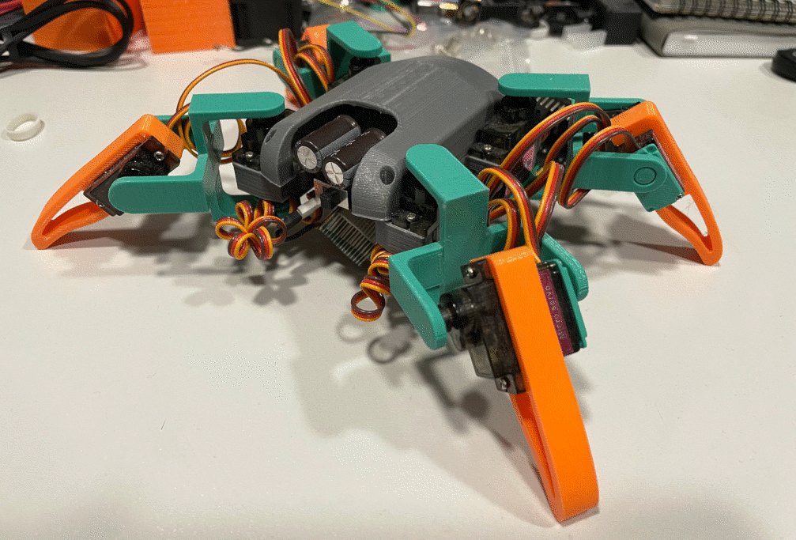
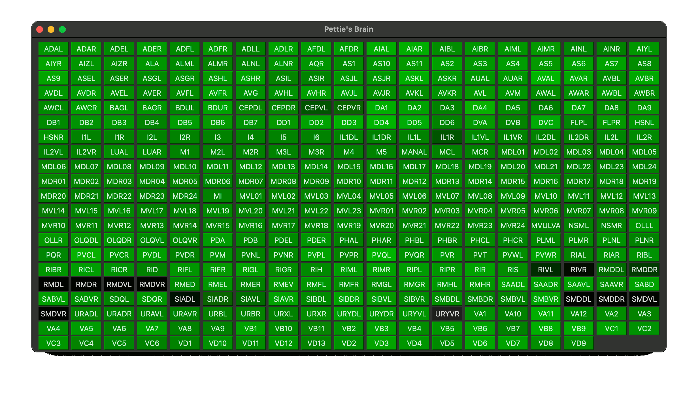

# Pettie

***

An *ESP32* quadruped robot driven by C.Elegans connectocome.

Why?
Why not!?

## Software

There a two sub-projects:
 - pettie-core
 - neuron-viewer

More info about sub-projects inside their folders.

### pettie-core

Contain an a ESP-IDF project for the ESP32 part.

### neuron-viewer

Project contain an a UI assistant tool to view Neurons of Pettie.
To use it, you're need a dedicated MQTT broker and Python.

There is no AI without Python :)

#### Disclaimer: The Joke about name 

Pretty Pettie Petty

https://en.wikipedia.org/wiki/John_Pettie

Yep, references to the musician, parrot song, and at the same time
most unimportant and small thing ;)
